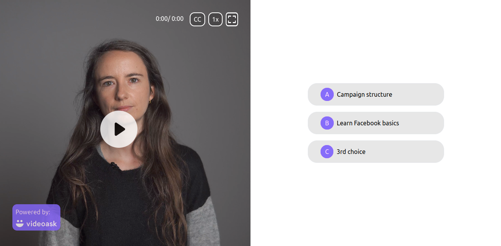
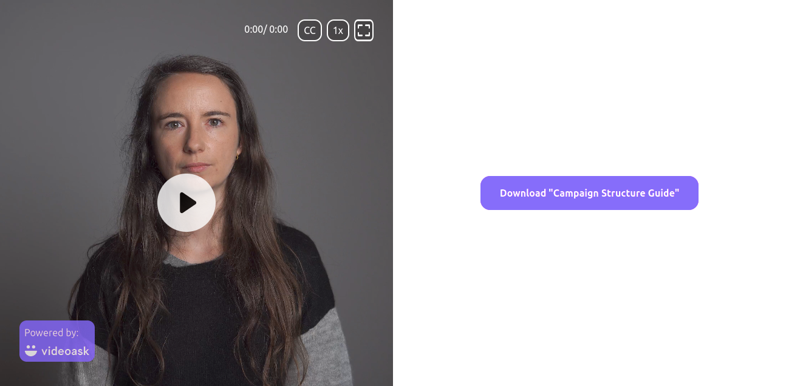
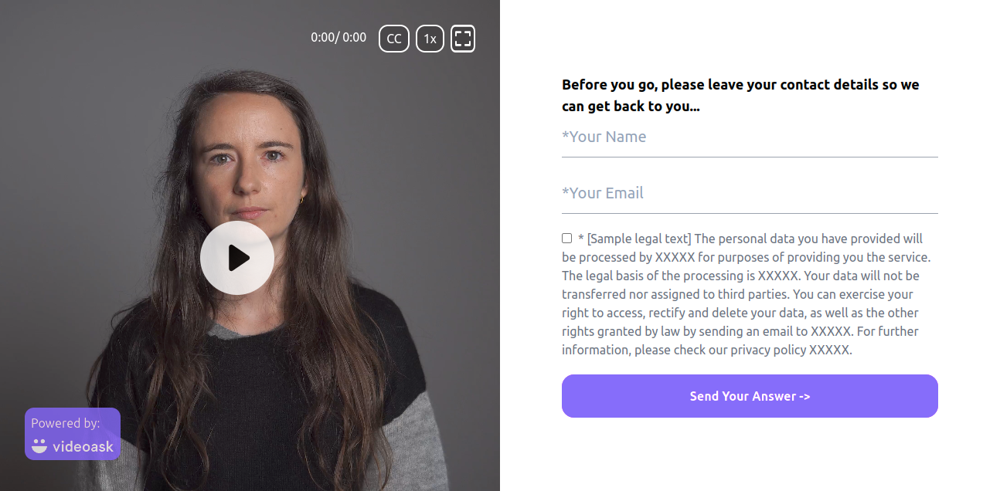

# Videoask Clone (React web App)

## Built With

* [React](https://docs.soliditylang.org/)
* [Redux-Toolkit](https://redux-toolkit.js.org/)
* [TailwindCss](https://tailwindcss.com/)

### Prerequisites

* [nodejs](https://nodejs.org/en/download/) and [npm](https://www.npmjs.com/)

#### How to use

Clone GitHub Project on your PC

```bash
git clone https://github.com/nayanrdeveloper/videoask_task_assignment
```

```bash
npm install
```

```bash
npx start
``

#### Screenshots



Campaign:



Form:


